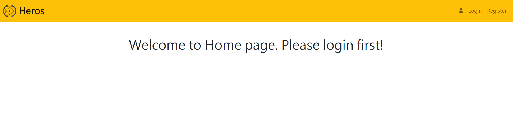
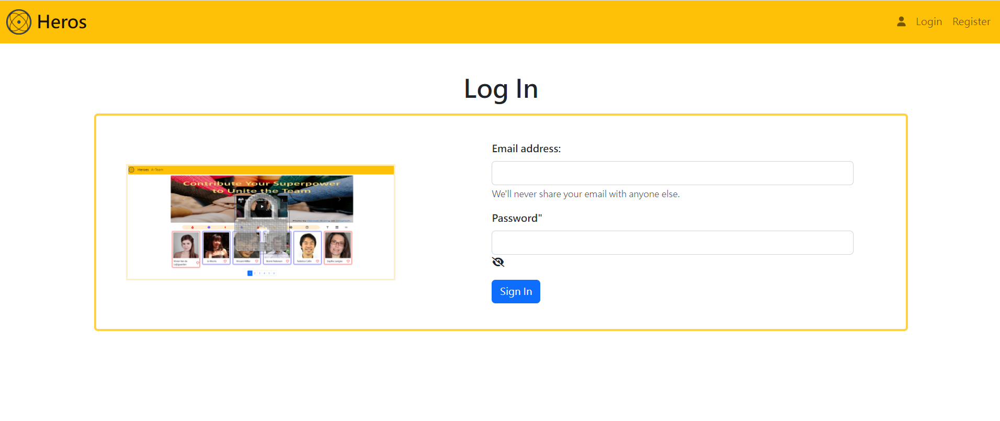

# User Login \_ v1

Home page before login

Login page


## 軟體及模組版本

```
"body-parser": "^1.20.0",
"dotenv": "^16.0.1",
"express": "^4.18.1",
"express-handlebars": "^4.0.2",
"method-override": "^3.0.0",
"mongoose": "^6.3.5"
```

## 安裝及執行

- 下載至本地

```
git clone https://github.com/wuwachon/UserLogin_v1.git
```

- 安裝相關套件

```
cd UserLogin_v1
npm install
```

- 本地 MongoDB 資料庫

  1. 修改`.env.example`檔案內 MONGODB_URI 使用者名稱及密碼等參數並移除`.example`副檔名

  2. 匯入 seeder 檔案

```
npm run seed
```

- 執行專案

```
npm run dev
```

Terminal 顯示 http://localhost:3000 即表示啟動完成，可至此網址網頁觀看畫面測試功能

## 專案功能描述

- 使用者可以登入或註冊新帳號
- 使用者登入或註冊帳號後自動跳轉回首頁並顯示使用者姓名
- 使用者可在登入狀態查看編輯帳號資訊

## 練習技巧

- 用 express CRUD method 模擬使用者登入認證
- Mongoose config 練習
